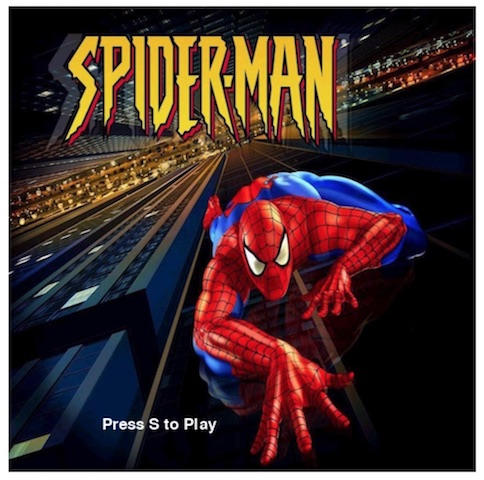
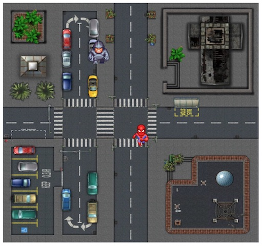
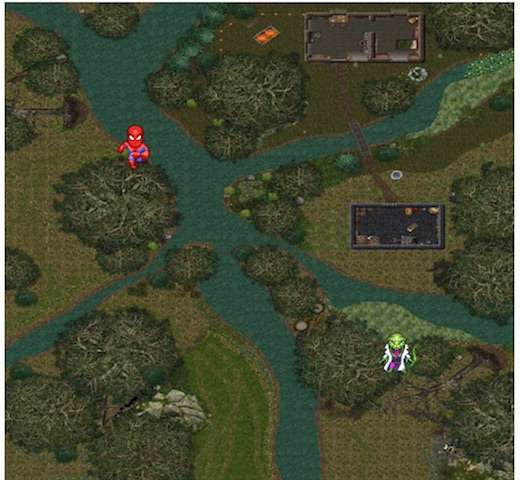
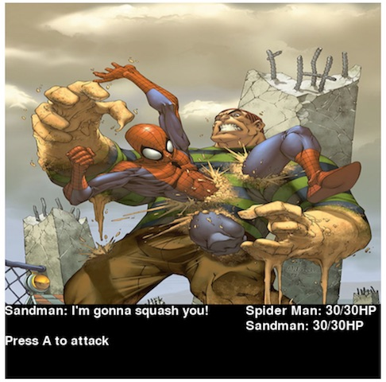

# Spider Man Game

This is a top-down game where you move the character around the map in order to fight
the villain of stage. When you encounter the enemy, it goes to the battle screen where you
fight them.

This game was built using Python and uses Pygame in order to use keyboard input, and screen refreshing.

## Installing

To get the game running, download the files and run the spiderman python file.

## Screenshots

Intro Screen




Rhino Level Map




Lizard Level Map




Sandman Level Map


Rhino Fight Screen


Lizard Fight Screen


Sandman Fight Scren




## Code Examples

The game is made up of different scenes, which include the creation of the map, the starting position of the characters,
and the game logic of level. The level map is created by setting the width and height of the entire screen before running Pygame's init function, which initializes Pygame. The picture of Spiderman, the level, the villain and the stage music are loaded at the start, and a clock is created using Pygame's clock method so that we can keep track of the game's framerate.

```

    #Screen
    width = 512
    height = 480
    blue_color = (97, 159, 182)

    pygame.init()

    #Music
    pygame.mixer.init()
    pygame.mixer.music.load('Spiderman.ogg')
    pygame.mixer.music.play(-1)

    screen = pygame.display.set_mode((width, height))
    background_image = pygame.image.load('images/rhino_background.png').convert_alpha()
    monster = pygame.image.load('images/rhino.png').convert_alpha()
    hero = pygame.image.load('images/hero.png').convert_alpha()
    pygame.display.set_caption('My Game')
    clock = pygame.time.Clock()


```

Both the character the player controls and the enemy moving on the stage are Character objects which get an initial starting position on the screen using x and y coordinates, a boolean value representing if they are dead or alive, as well as a small picture of themselves. The These characters move across the screen by incrementing their x and y positions by small amounts every second.

```

    class Character(object):
        def __init__(self, x, y, image):
            self.x = x
            self.y = y
            self.x_dir = 1
            self.y_dir = 1
            self.image = image
            self.alive = True


        def displayCharacter(self,screen):
            if self.alive == True:
                screen.blit(self.image, (self.x,self.y))
            else:
                print "dead"

        def move_character(self):
            self.x += self.x_dir
            self.y += self.y_dir

```

The enemy's random movement is created by assigning a number to North, South, East, West, NE, NW, SW, and SE. The function creates a random number, and makes the enemy move in that direction for a second, making them move randomly around the map. The villain's random directions are switched based on the framerate.

```

        def change_direction(self):

            rand_direction = random.randint(0,7)

            if rand_direction == 0:   # top or north
                self.x_dir = 0
                self.y_dir = -1

            elif rand_direction == 1:  #right or east
                self.x_dir = 1
                self.y_dir = 0

            elif rand_direction == 2:  #down or south
                self.x_dir =0
                self.y_dir = 1

            elif rand_direction == 3:  #left or west
                self.x_dir =-1
                self.y_dir = 0

            elif rand_direction == 4:   # Northeast - topright
                self.x_dir = 1
                self.y_dir = -1

            elif rand_direction == 5:  # Northwest - top left
                self.x_dir = -1
                self.y_dir = -1

            elif rand_direction == 6:  # Southwest - bottom left
                self.x_dir = -1
                self.y_dir = 1

            elif rand_direction == 7:  # South east - bottom right
                self.x_dir = 1
                self.y_dir = 1

```

To control the character with the keyboard, we set letters and arrows to their respective ASCII codes
and then change Spiderman's movement by changing the amount his x and y coordinates are suppose to change
each frame.

```

	KEY_UP = 273
	KEY_DOWN = 274
	KEY_RIGHT = 275
	KEY_LEFT = 276
	KEY_A = 97
	KEY_Q = 113
	KEY_S = 115


	#Keyboard Input
	if event.type == pygame.KEYDOWN:
	    # activate the cooresponding speeds
	    # when an arrow key is pressed down
	    if event.key == KEY_DOWN:
	        ball.speed_y = 5
	    elif event.key == KEY_UP:
	        ball.speed_y = -5
	    elif event.key == KEY_LEFT:
	        ball.speed_x = -5
	    elif event.key == KEY_RIGHT:
	        ball.speed_x = 5
	if event.type == pygame.KEYUP:
	    # deactivate the cooresponding speeds
	    # when an arrow key is released
	    if event.key == KEY_DOWN:
	        ball.speed_y = 0
	    elif event.key == KEY_UP:
	        ball.speed_y = 0
	    elif event.key == KEY_LEFT:
	        ball.speed_x = 0
	    elif event.key == KEY_RIGHT:
	        ball.speed_x = 0

```

The fight scenes are made by creating a new level with the top portion of the screen dedicated to an image of Spiderman fighting
the villain. The bottom portion is reserved for updating text variables each time the player attacks the enemy. The hero and villain get a
an attack value that's a random number. That number is subtracted from their health when they fight. Each hit lowers both the hero and villain's health, and this information is updated to the bottom screen to let the player see how the fight is progressing. The battle ends when either character's health drops below 0.

```

    hero_health = 30
    orc_health = 20

    hero_message = "Press A to attack"
    orc_message = ""
    health_message = "Spider Man: %s/30HP" % hero_health
    orc_health_message = "Rhino: %s/20HP" % orc_health

    stop_game = False
    while not stop_game and orc_health > 0 and hero_health > 0:
        for event in pygame.event.get():
            # Event handling
            if event.type == pygame.KEYDOWN:
                if event.key == KEY_DOWN:
                    print "Invalid Input"
                elif event.key == KEY_A:
                    sound.play()
                    hero_damage = random.randrange(1,6)
                    orc_damage = random.randrange(1,4)
                    hero_message = "You attack Rhino for %d damage!" % hero_damage
                    orc_message = "Rhino attacks you for %d damage!" % orc_damage
                    orc_health -= hero_damage
                    hero_health -= orc_damage
                    health_message = "Spider Man: %s/30HP" %str(hero_health)
                    orc_health_message = "Rhino: %s/20HP" %str(orc_health)
                elif event.key == KEY_LEFT:
                    print "Invalid input"
                elif event.key == KEY_RIGHT:
                    print "Invalid input"
            if event.type == pygame.QUIT:
                stop_game = True

```


## Author

* **Justin Uzoije**  - [GitHub Page](https://github.com/justinuzoije)

## License

This project is licensed under the MIT License - see the [LICENSE.md](LICENSE.md) file for details

## Acknowledgments

* Marvel Comics
